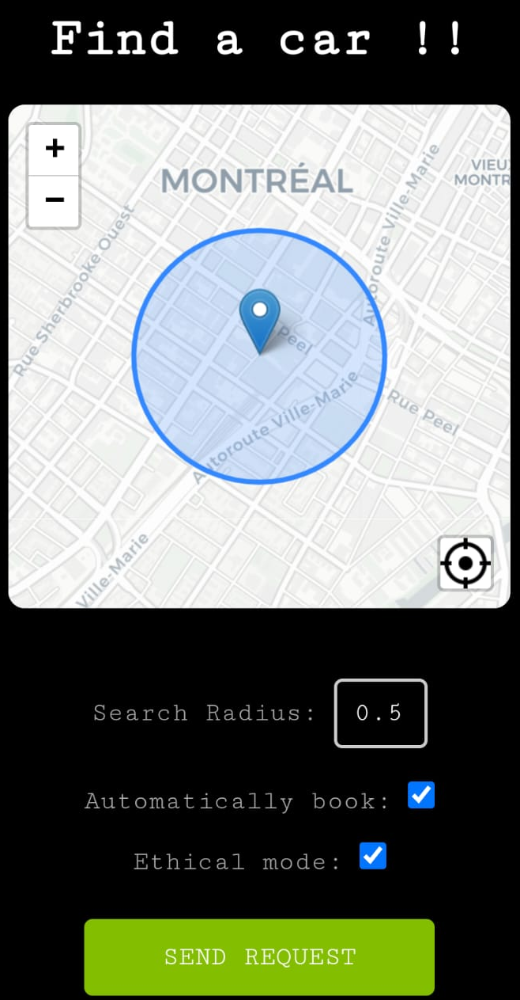

# flex-app

This tool allows for easy booking of flex cars in Montreal.

When you're all set up, this is the interface you'll see. You can use this app to get a notification when a car is available, or automatically book flex cars. Just choose a location on the map, adjust the search radius, and request a car. The app will scan within your radius every 5 seconds. If no car is found within half an hour, you will get a notification that the search has stopped. 

<p align="center">
    
</p>

## Access

Available: [flexflexflex.connbrack.com]()


[flexflexflex.connbrack.com/docs](https://flexflexflex.connbrack.com/docs)

Contact me for access.

#### Self-host

Unless you're a friend of mine :), you'll have to self-host. Clone the project and deploy it on your favorite cloud application hosting service. Currently, this instance is hosted on [render](https://render.com/).

When self-hosting, set up an environmental variable KEYS containing corresponding to your user's pushbullet API keys, to allow them to have access.

For example:

```
KEYS='user1:<pushbullet API key>,user2:<pushbullet API key>'
```

## Usage
For detailed instructions see the [docs](https://flexflexflex.connbrack.com/docs).

#### For notifications only:

```
flexflexflex.connbrack.com/?key=<your pushbullet API key>
``````

The system relies on pushbullet to notify you when cars are booked [Pushbullet](https://www.pushbullet.com/). The key can be generated here:

* https://www.pushbullet.com/
* settings > account > create access token

#### To enable autobook, your communauto credentials must be inputted

```
https://flexflexflex.connbrack.com/?key=<your pushbullet API key>&login_cred=<customer ID>,<your.email@mail.com>,<your password>
```


